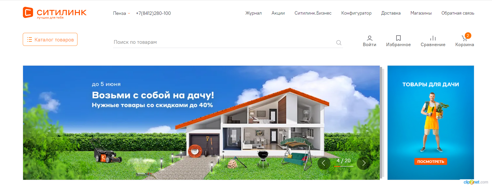
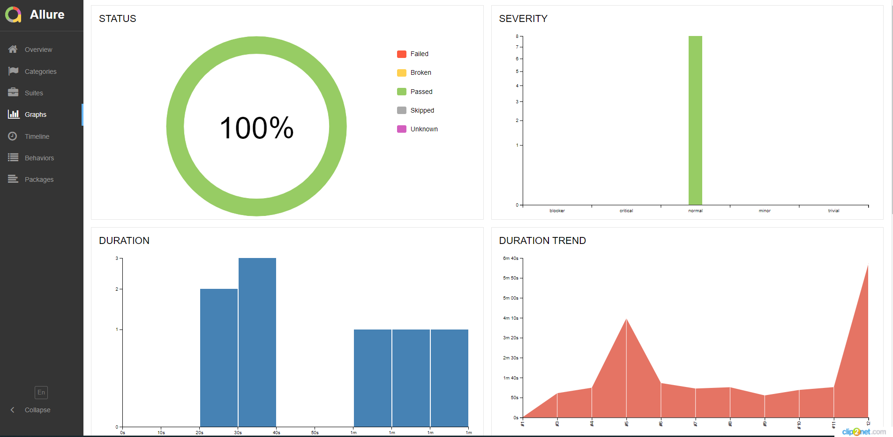
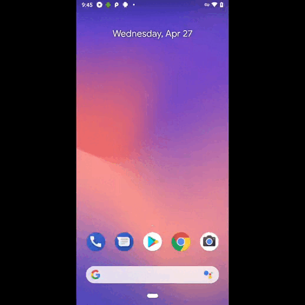
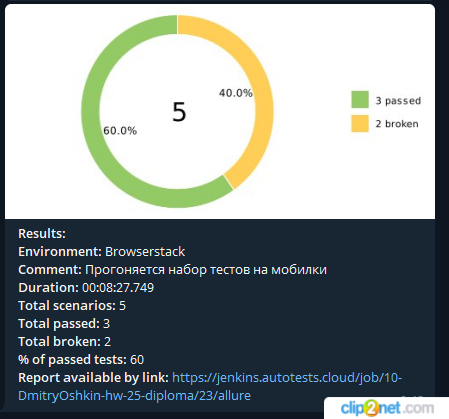

# Проект по автоматизации тестов для магазина citilink
<a target="_blank" href="https://www.citilink.ru/">Citilink</a>

<p align="center">

</p>


## Содержание
+ [Описание проекта](#Description)
+ [Технологии и инструменты](#Technology)
+ [Запуск тестов в Jenkins](#Jenkins)
    + [Параметры  сборки](#SystemProperty)
+ [Отчет о результатах тестирования в Allure Report](#AllureReport)
+ [Интеграция с Allure TestOps](#AllureTestOps)
+ [Результаты выполнения тестов](#Results)


## <a name="Description">Описание проекта</a>
- Данный проект реализован как финальная работа по подведению итогов прохождения курсов на портале QA GURU;
- В качестве объекта тестирования выбран портал citilink.ru;


# <a name="Technology">Технологии и инструменты</a>
<p  align="center">
  <code></code>
  <code></code>
  <code></code>
  <code></code>
  <code></code>
  <code></code>
  <code></code>
  <code></code>
  <code></code>
  <code></code>
  <code></code>
  <code></code>
  <code></code>
  <code></code>
  <code></code>

</p>

Проект реализован на **Java** с использованием фреймворка **Selenide**.
Для сборки проекта используется **Gradle**.  
**JUnit 5** используется как фреймворк для модульного тестирования.
Запуск тестов выполняется из **Jenkins**.
**Selenoid** используется для запуска браузеров в контейнерах **Docker**.
**Browserstack** используется для запуска мобильных тестов, также для локального запуска
используются инструменты **Android Studio** и **Appium**.
**Allure Report, Telegram Bot** используются для визуализации результатов тестирования.


# <a name="Jenkins">Запуск тестов в [Jenkins](https://jenkins.autotests.cloud/job/10-DmitryOshkin-hw-25-diploma/)</a>

Для запуска тестов на разных инструментах в Jenkins была создана job (джоба). 
Для возможности запуска разных видов тестов (API, UI, Mobile), добавлены параметры:
**TASK** - для выбора задачи по запуску тестов api_tests, ui_tests, mobile_android_tests.
**DEVICEHOST** - для выбора устройства на котором будут запущены тесты (ui - удаленный запуск ui и api тестов на Selenoid,
browserstack - для запуска mobile тестов на ресурсе browserstack).
**Не обязательные параметры**:
**COMMENT** - комментарий для нотификации по результату прогона.
**BOTTOKEN** - токен настроенного Telegram bota который отправляет оповещения о результатах прогона.
**CHATID** - id Telegram чата в котором происходит информирование о результатах прогона.
**ENVIRONMENT** - для выбора окружения на котором запускаются сценарии. 


Для запуска небходимо заполнить параметры сборки показанные на скришоте ниже.
<p  align="center">

</p>


## <a name="SystemProperty">Параметры  сборки</a>
### Локальный запуск :

```
gradle clean ${TASK} -DdeviceHost=${DEVICEHOST}
```

### Удаленный запуск :
```
clean 
${TASK} 
-DdeviceHost=${DEVICEHOST}
```


# <a name="AllureReport">Отчет о результатах тестирования в [Allure Report](https://jenkins.autotests.cloud/job/10-DmitryOshkin-hw-25-diploma/14/allure/)</a>

#### Общая информация
Главная страница Allure-отчета содержит следующие информационные блоки:

>- <code><strong>*ALLURE REPORT*</strong></code> - отображает дату и время прохождения теста, общее количество прогнанных кейсов, а также диаграмму с указанием процента и количества успешных, упавших и сломавшихся в процессе выполнения тестов
>- <code><strong>*TREND*</strong></code> - отображает тренд прохождения тестов от сборки к сборке
>- <code><strong>*SUITES*</strong></code> - отображает распределение результатов тестов по тестовым наборам
>- <code><strong>*CATEGORIES*</strong></code> - отображает распределение неуспешно прошедших тестов по видам дефектов
<p align="center">
  
</p>

### Список тестов c описанием шагов и визуализацией результатов
На данной странице представляется стандартное распределение выполнявшихся тестов по тестовым наборам или классам, в
которых находятся тестовые методы.

<p align="center">
  
</p>

### Графики
На данной странице представляется стандартное распределение выполнявшихся тестов по тестовым наборам или классам, в
которых находятся тестовые методы.

<p align="center">
  
</p>

# <a name="AllureTestOps">Интеграция с [Allure TestOps](https://allure.autotests.cloud/project/1260/)</a>

### Основной дашборд
<p align="center">
  
</p>

### Дашборд по разным типам тестов
<p align="center">
  
</p>

### Запуски
<p align="center">
  
</p>

### Результат запуска
<p align="center">
  
</p>

### Тест-кейсы
<p align="center">
  
</p>


# <a name="Results">Результаты выполнения тестов</a>

### Пример запуска теста в Browserstack
<p align="center">
  
</p>

### Пример запуска теста в Selenoid
<p align="center">
    
</p>

### Уведомления в Telegram
<p align="center">
  
</p>
